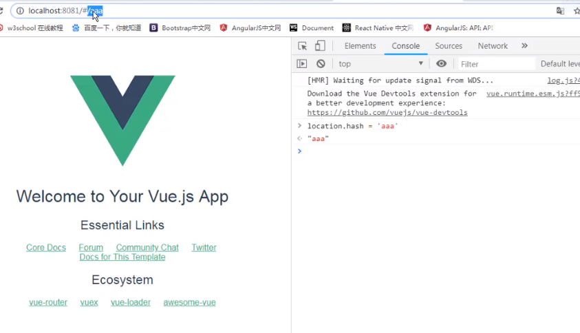
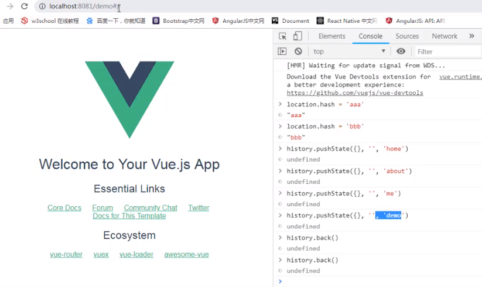
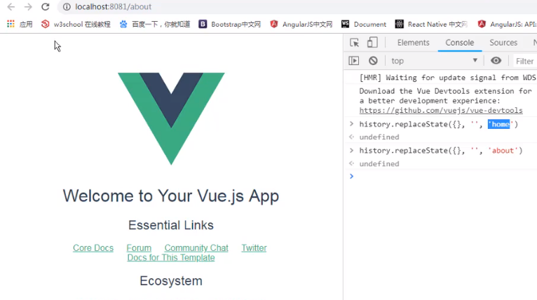
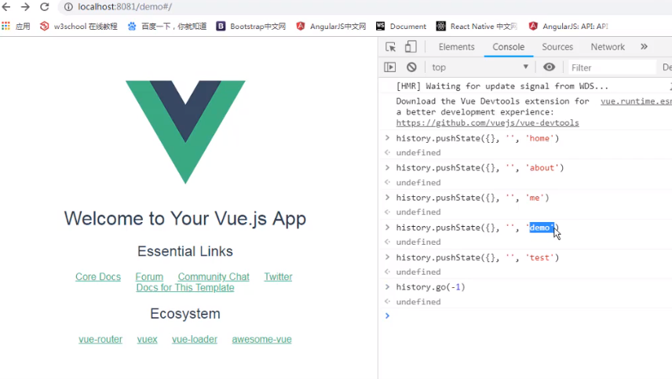

## url的hash
    
    改变url的hash是的url变更，但是页面并不会刷新，即没有去服务器重新请求资源。正常url的变更会使浏览器去服务器重新请求资源并刷新页面，如location.href就会刷新页面。当使用hash方式改变url时，我们可以在前端
去监听hash的变化，并维护一个url的映射，则可以实现前端路由。
## HTML 5的history
    
    使用HTML 5的的history.pushState同样能够实现hash的效果，实际上pushState就是将变量压入一个栈中，当前的url永远是栈顶的地址，从而实现回退（history.back()）、前进（history.forward()）之类的功能。    
    
    history.replace()也能改变url而不刷新页面，但是其只是简单替换，而没有pushState的出入栈操作，即不管是back()方法还是浏览器的返回按钮都是无效的。    
    
    但使用go()方法可以跳转到指定的页面但必须使用的是pushState，replaceState情况下是无效的，go方法参数不仅仅只能是负数，也能用负数。
## vue的Router
    vue的Router默认的就是使用hash的方式，可以通过配置实现history模式。
    目前流行的三大框架都有自己的路由实现：
        1. Angular的ngRouter
        1. React的ReactRouter
        1. Vue的vue-router
    vue-router是基于路由和组件的：
        1. 路由用于设定访问路径，将访问路径和组件映射起来
        1. 在vue-router的单页面应用中，页面的路径改变就是组件的切换
## vue-router使用    
