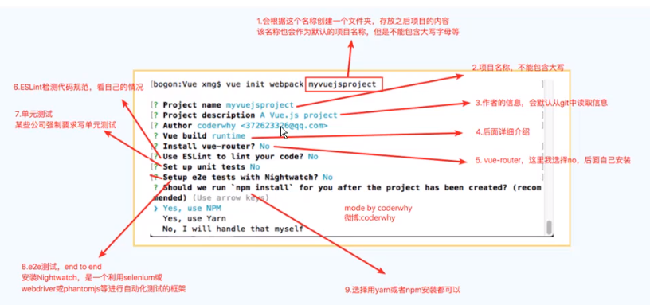
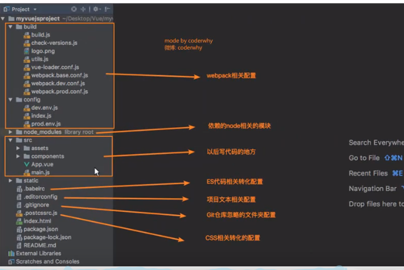

### 安装vue-cli
1. 脚手架3：npm install -g @vue/cli
1. 脚手架3初始化的方式：vue create projectName
1. 在脚手架3的基础上使用脚手架2的初始化方式是不行的
1. 拉取2.x脚手架：npm install -g @vue/cli-init
1. 脚手架2初始化项目：vue init webpack projectName
### vue-cli2
#### vue-cli2初始化项目
``` 
vue init webpack cli-vue2-test
```

#### vue-cli2项目结构
    static目录会原封不动的复制到dist中，不会想src中的图片一样需要考虑是转成base64还是复制图片

### runtime-only和runtime-compiler对比（01为compiler版本、02为only版本）
