### 安装vue-cli
1. 脚手架3：npm install -g @vue/cli
1. 脚手架3初始化的方式：vue create projectName
1. 在脚手架3的基础上使用脚手架2的初始化方式是不行的
1. 拉取2.x脚手架：npm install -g @vue/cli-init
1. 脚手架2初始化项目：vue init webpack projectName
### vue-cli2
#### vue-cli2初始化项目
``` 
vue init webpack cli-vue2-test
```

#### vue-cli2项目结构
    static目录会原封不动的复制到dist中，不会想src中的图片一样需要考虑是转成base64还是复制图片

### runtime-only和runtime-compiler对比（01为compiler版本、02为only版本）
#### 区别
    其实两者的区别就在于main.js中使用组件的方式，compiler模式方式使用了template，而only模式使用了render函数进行替代
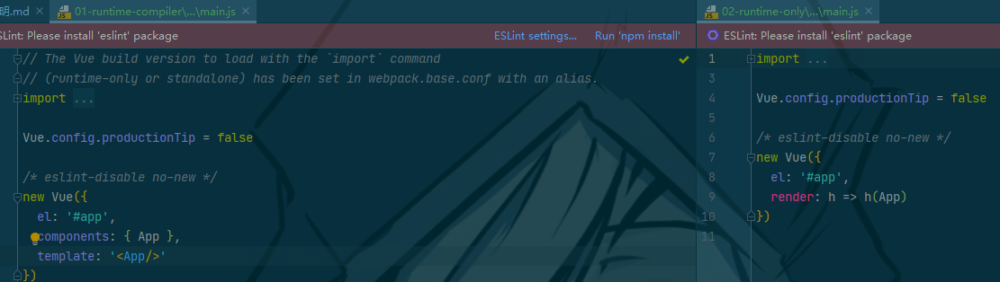
#### vue运行过程
```
//compiler的过程
//template->ast->render->vdom-ui

//only的过程(1.性能更高  2.代码量更少)
//render->vdom->ui

//render函数不使用箭头函数时应该为
render: funcation(createElement) {
    //1.普通用法（创建标签）：createElement('标签', {标签属性}, ['内容'])
   
    return createElement('h2'， 
        {class：'box'}, 
            ['Hello World', createElement('button', ['按钮'])]);
            
    //2. 传入组件，虽然在only模式中App.vue等文件中函数有template，但实际上这些文件中的tempalte会由
    vue-template-compiler解析为render函数，我们导入组件的时候不是去导入那个文件而是组件对象，对象中
    已经就是render函数了而不是tempalte
    return createElement(组件对象)
}
```
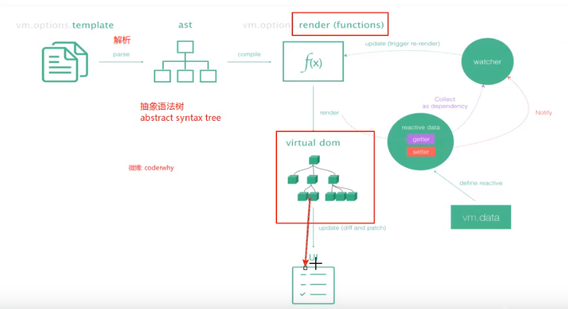
#### npm run build
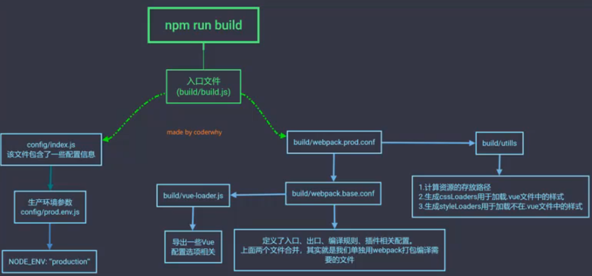
#### npm run dev
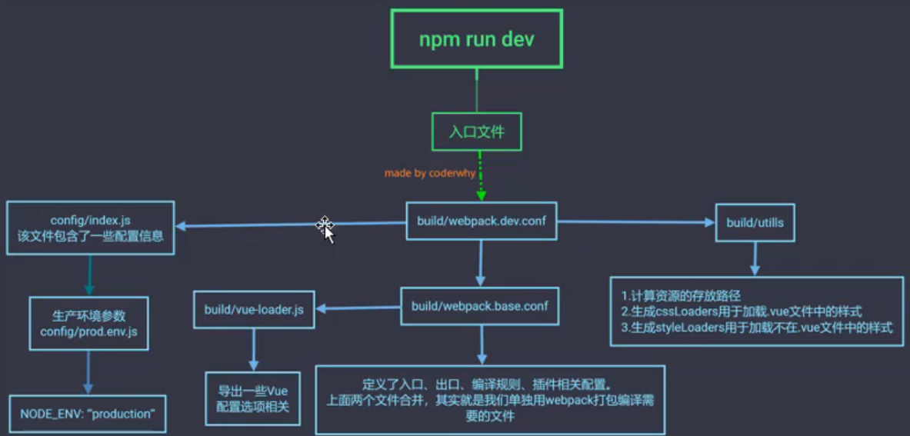
### cli2和cli3区别
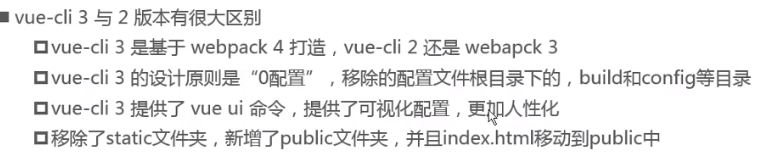
### cli3创建项目
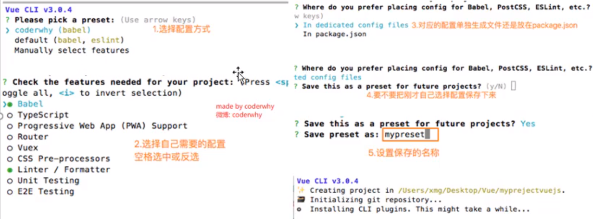
#### 项目结构
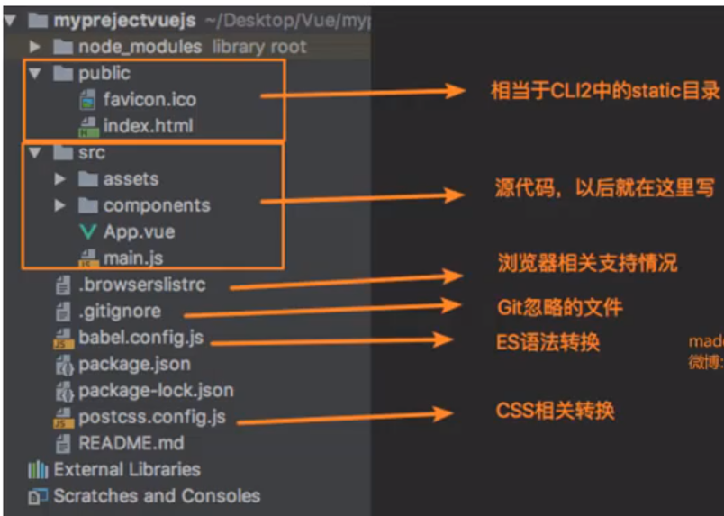
#### 项目配置
    当我们安装了cli3之后，同时就安装了vue ui。此时我们只要执行vue ui就会启动一个本地服务器，其可以管理我们的cli3项目，包括创建项目、导入项目以及管理配置。
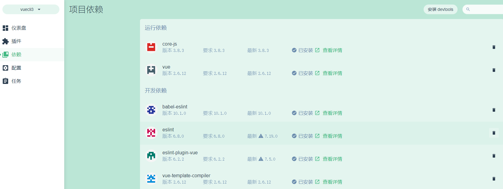
    实际上配置被放到了cli-service中
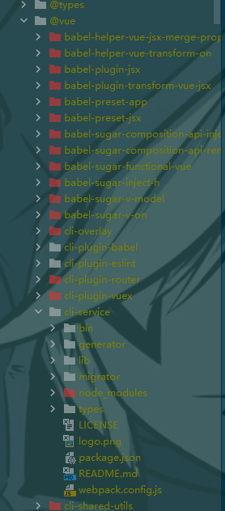
    如果确实需要手动配置一些内容，则在项目中新增vue.config.js文件
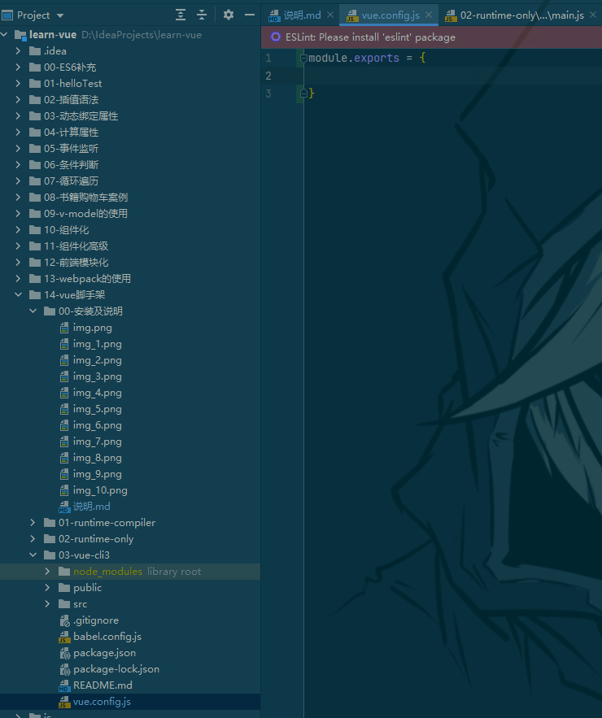
### 路由
#### 什么是路由
    路由就是通过互联的网络把信息从源地址传输到目的地址的活动。
    路由提供两种机制：路由和转送
        1. 路由是决定数据包从来源到目的地的路径
        1. 转送将输入端的数据转移到合适的输出端
    路由中有一个重要的概念叫路由表，路由表本质上就是一个映射表，决定了数据包的指向。
#### 前端路由和后端路由（前端渲染和后端渲染）
1. 后端路由（后端渲染）：如jsp（java server page）其从服务器传到浏览器的时候已经渲染出来了，早期其中一般只包括HTML+CSS。后端处理URL和页面之间的映射关系就是后端路由
   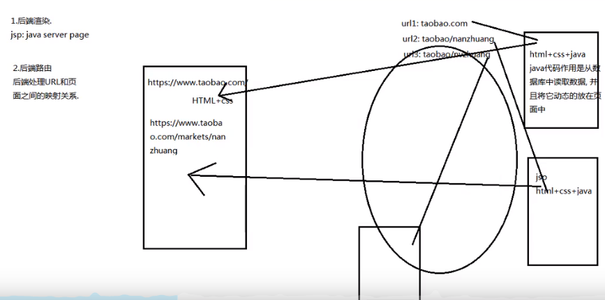
1. 前后端分离（前端渲染）
    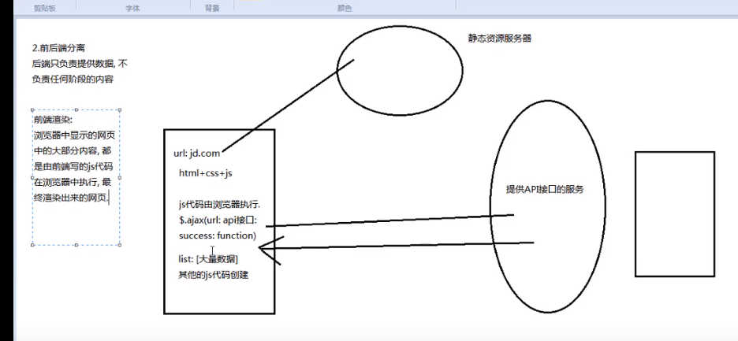
1. 前端路由（单页面富应用阶段）
    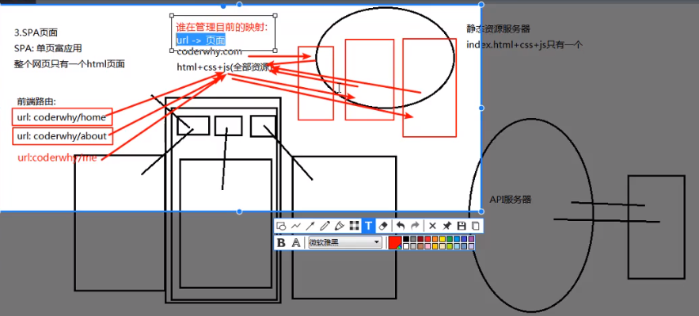