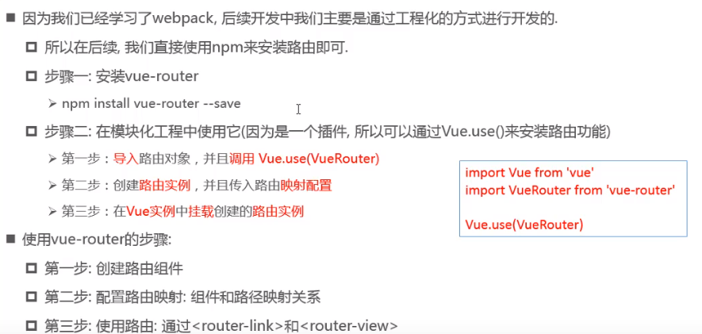
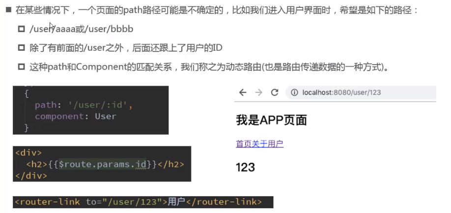
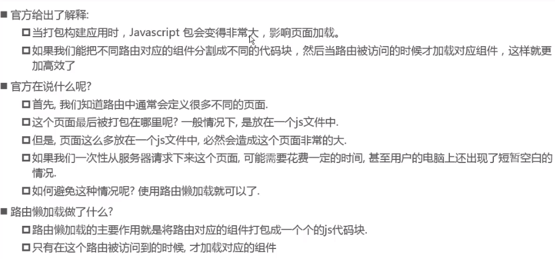
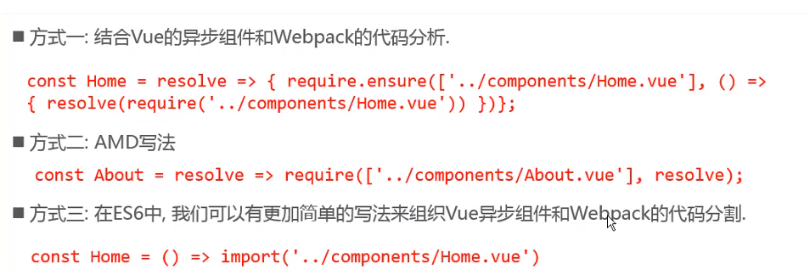
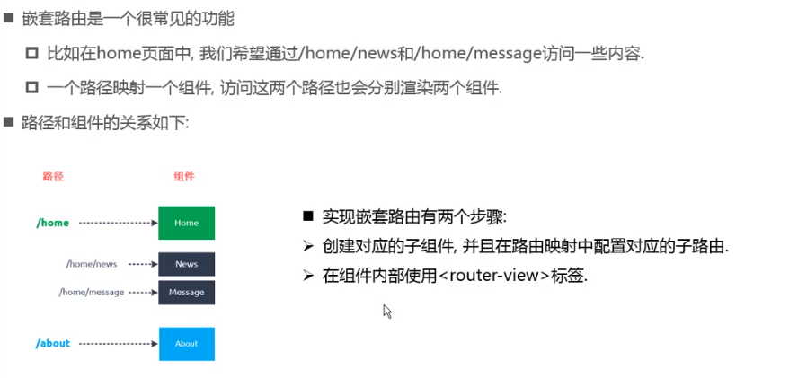
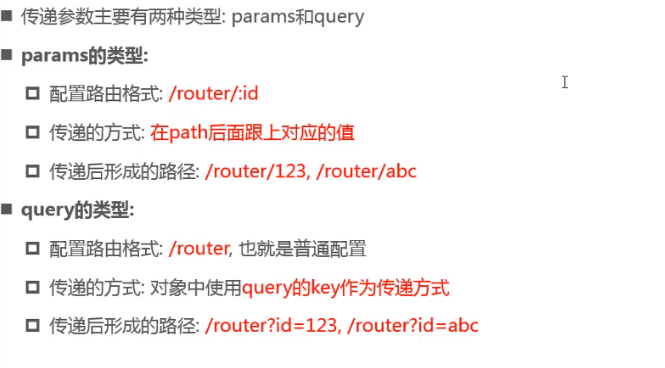
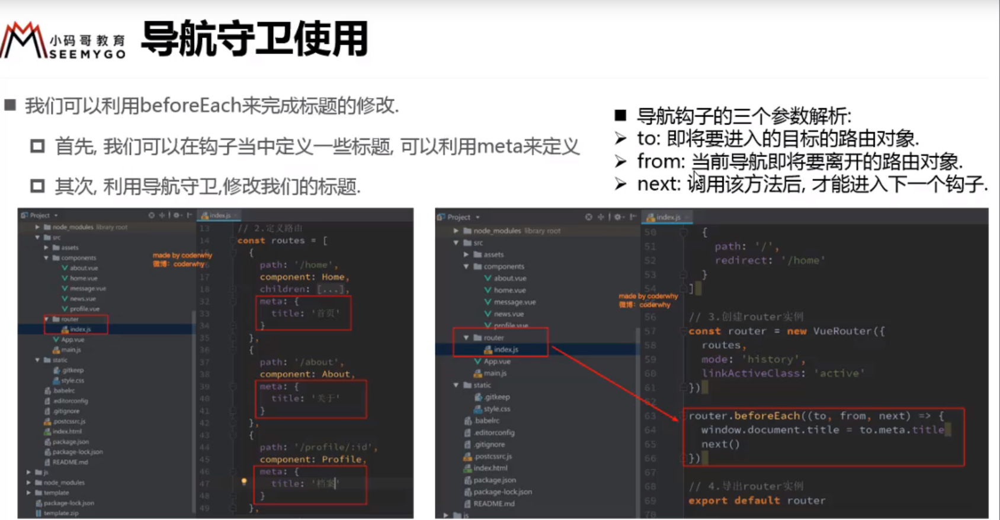
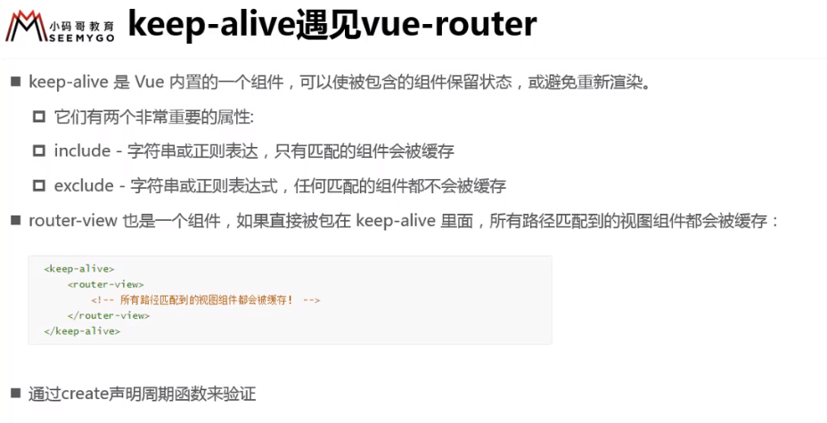

## vue的Router
    vue的Router默认的就是使用hash的方式，可以通过配置实现history模式。
    目前流行的三大框架都有自己的路由实现：
        1. Angular的ngRouter
        1. React的ReactRouter
        1. Vue的vue-router
    vue-router是基于路由和组件的：
        1. 路由用于设定访问路径，将访问路径和组件映射起来
        1. 在vue-router的单页面应用中，页面的路径改变就是组件的切换
## vue-router使用

### 动态路由

## 项目打包
    当我们去请求页面的时候，如果所有js都打包在一个js中，那么首次去请求的时候可能会出现长时间的等待，vue脚手架打包会将我们都 js、css等资源进行打包，而不是像我们之前那样简单粗暴的打包成一个bundle.js。
    
## 路由懒加载
    虽然默认打包的时候会去分包，但项目越做越大，那包含我们业务逻辑代码的js就会越来越大，同样会影响用户体验。第三方代码和底层支撑代码都是必须的，所以第一次请求必须要得到，但业务逻辑的那个js我们可以进行拆分，按照组件树的形式去拆分。路由的懒加载则可以实现这个效果。
    
    对比

    懒加载方式    

## 嵌套路由

## 路由传递参数

## 导航守卫使用
    
     
## keep-alive保留页面状态信息    
