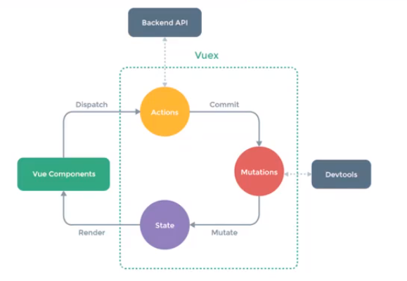

## 什么是vuex
    Vuex是一个专为Vue.js应用程序开发的状态管理模式。
    1. 它采用集中式存储管理应用的所有组件的状态，并以相应的规则保证状态以一种可预测的方式发生变化。
    1. Vuex也集成到Vue的官方调试工具devtools extension，提供了诸如零配置的time-travel调试、状态快照导入导出等高级调试功能。
## 什么是状态管理
    需要多个组件共享的变量全部存储在一个对象里面，然后将这个对象放在顶层的Vue实例中（类似于全局变量），让其他组件可以使用，使用Vuex时它还是响应式的。
## 什么状态需要使用Vuex管理
    1. 登录信息：登录后会返回一个token，之后每个请求都需要带token才能访问。
    1. 用户名称、头像、地里位置信息等多个地方需要使用的内容
    1. 商品的收藏、购物车中的物品等等，都是需要在多个页面共享的内容
## Vuex状态管理图例

    引用state中内容时直接引用，当修改的时候需dispatch到actions后在commit到mutations中修改state，按这种方式修改state中内容那么Devtools就可以跟踪state的变化