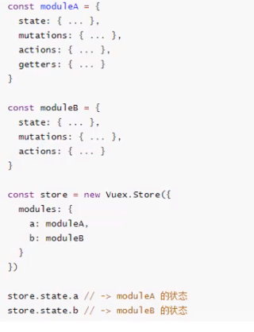
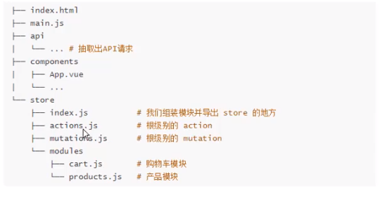

## 什么是vuex
    Vuex是一个专为Vue.js应用程序开发的状态管理模式。
    1. 它采用集中式存储管理应用的所有组件的状态，并以相应的规则保证状态以一种可预测的方式发生变化。
    1. Vuex也集成到Vue的官方调试工具devtools extension，提供了诸如零配置的time-travel调试、状态快照导入导出等高级调试功能。
## 什么是状态管理
    需要多个组件共享的变量全部存储在一个对象里面，然后将这个对象放在顶层的Vue实例中（类似于全局变量），让其他组件可以使用，使用Vuex时它还是响应式的。
## 什么状态需要使用Vuex管理
    1. 登录信息：登录后会返回一个token，之后每个请求都需要带token才能访问。
    1. 用户名称、头像、地里位置信息等多个地方需要使用的内容
    1. 商品的收藏、购物车中的物品等等，都是需要在多个页面共享的内容
## Vuex状态管理图例

    引用state中内容时直接引用，当修改的时候需dispatch到actions后在commit到mutations中修改state，按这种方式修改state中内容那么Devtools就可以跟踪state的变化。
actions处理异步操作，mutations处理同步操作
## Vuex核心概念
1. State：就是放状态的，即统一管理的变量。state单一状态树即单一数据源，推荐只实例化一个store，统一所有需要状态管理的数据都放在这一个store方便管理。
1. Getters：类似于组件中的计算属性，当数据需要经过处理后再使用时使用
1. Mutations：官方推荐更新state一定是用mutations，哪怕是先走actions异步方法最后还是走mutations更新state。其内必须使用同步方法，异步方法其实也是有效的，但是devtools无法跟踪，可能会导致页面更新了数据，但devtools中的数据没有变化，
   实在要使用异步操作则使用actions作为中间步骤。mutations响应式的规则：变量应该在state中是初始化好的，包括对象中的属性，没有的属性vue是没有监听的，否则只能使用Vue.set()函数将该属性加入响应式属性；使用delete state.info.age不是响
   应式的，需要使用Vue.delete(state.info, 'age');
1. Actions：其内一般做我们需要的异步操作,其作为mutations需要异步操作的中转
1. Moudles：因官方推荐单一状态树，所以提供moudles来进行模块划分，在模块中的getters还有第三个参数rootState    
    
## store的项目结构整理
