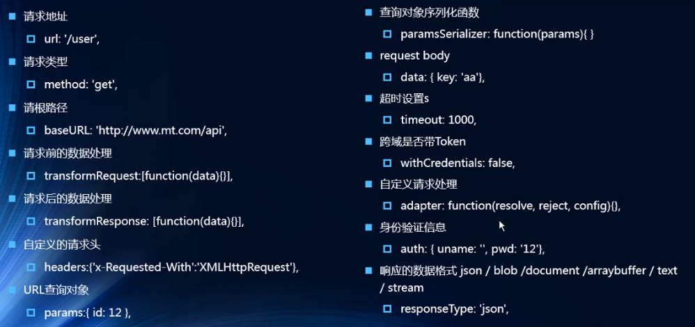

## 网络模块选择
1. 传统的Ajax是基于XMLHttpRequest（XHR）:配置和调用方式等非常混乱，很少直接使用，而是使用jQuery-Ajax
1. jQuery-Ajax：在Vue的整个开发中都是不需要使用jQuery的，如果要使用Ajax必须引入整个jQuery，jQuery代码1W+行，Vue的代码才1W+行
1. Vue1.X的时候，推出了Vue-resource：在Vue2.0推出后，Vue作者说明去掉该工具，并且以后不会再更新
1. axios：有非常多优点，且使用起来非常方便，官方推荐。
## jsonp
使用jsonp最主要的原因往往是为了解决跨域的问题，其核心在于通过`<script>`标签的src来帮助我们请求数据。         
     
     
     
## axios
1. 在浏览器中发送XMLHttpRequest请求
1. 在node.js中发送http请求
1. 支持Promise API
1. 拦截请求和响应
1. 转换请求和响应数据
### 支持多种请求方式
1. axios(config)
1. axios.request(config)
1. axios.get(url`[, config]`)
1. axios.post(url`[, data[, config]]`)
1. axios.delete(url`[, config]`)
1. axios.put(url`[, data[, config]]`)
1. axios.head(url`[, config]`)
1. axios.patch(url`[, data[, config]]`)
### 常见配置选项

### 拦截器

