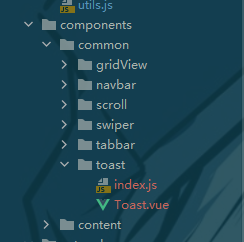

### 组件代码
```vue
<template>
  <div class="toast" v-show="isShow">
    <div>{{message}}</div>
  </div>
</template>

<script>
export default {
  name: 'Toast',
  /* props: {
    message: {
      type: String,
      default: ''
    },
    show: {
      type: Boolean,
      default: false
    }
  } */
  data() {
    return {
      message: '',
      isShow: false
    }
  },
  methods: {
    show(message, duration = 1000) {
      this.isShow = true
      this.message = message

      setTimeout(() => {
        this.isShow = false
        this.message = ''
      }, duration)
    }
  }
}
</script>

<style scoped>
.toast {
  position: fixed;
  top: 50%;
  left: 50%;
  padding: 8px 10px;
  color: #fff;
  transform: translate(-50%, -50%);
  background-color: rgba(0, 0, 0, .75);

  z-index: 999;
}
</style>
```

### index文件
```javascript
import Toast from '@/components/common/toast/Toast'

// 插件式分装组件
const obj = {}

// 利用Vue.use()函数会执行插件的install方法来封装组件，use默认会把Vue传参过来
obj.install = function (Vue) {
  // 1.创建组件构造器
  const toastContrustor = Vue.extend(Toast)

  // 2.通过new的方式使用组件构造器创建出来一个组件对象
  // eslint-disable-next-line new-cap
  const toast = new toastContrustor()

  // 3.将组件对象，手动挂载到某一个元素上
  toast.$mount(document.createElement('div'))

  // 4.toast.$el对应的就是div
  document.body.appendChild(toast.$el)

  Vue.prototype.$toast = toast
}

export default obj
```
### main.js中安装插件
```javascript
// 安装toast插件,use就会执行对象的install函数
Vue.use(toast)
```
### 使用组件
```javascript
this.$toast.show(res, 500)
```
### 结构

