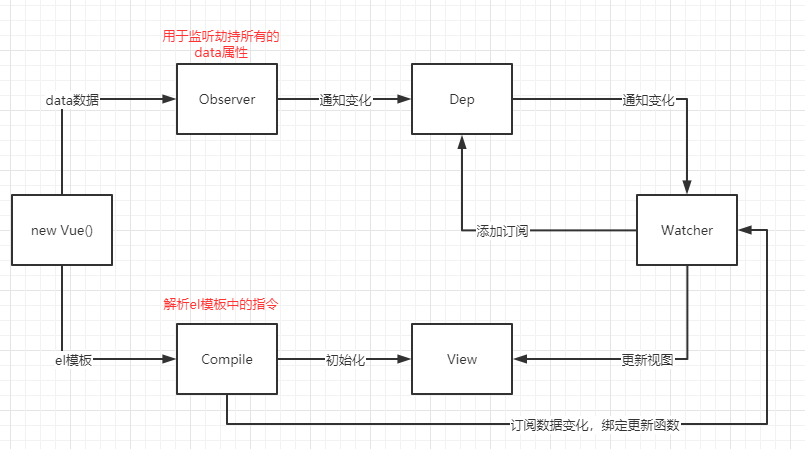

         
1. app.message修改数据时，vue内部是如果监听message数据的改变
   * Object.defineProperty -> 监听对象属性的改变
```javascript
// 相当于通过new Vue中的data传进来的对象
const obj = {
  message: '哈哈哈',
  name: 'lql' 
}  
     
// vue接收到传进来的数据对象后进行的操作
Object.keys(obj).forEach(key => {
 let value = obj[key]

  // 将obj中的key重新定义方便监听
  Object.defineProperty(obj, key, {
     set(newValue) {
        console.log('监听' + key + '改变')
        // 根据解析html代码，获取到哪些人有用该属性，监听到了之后谁用告诉谁该数据发生了更新
        dep.notify()
        value = newValue
     },
     get() {
        console.log('获取' + key + '对应值');
        // 谁用了肯定会调用get方法
        const dep = new Dep()

        const watcher = new Watcher('张三')
        dep.addSub(watcher)

        const watcher2 = new Watcher('李四')
        dep.addSub(watcher2)

        const watcher3 = new Watcher('王五')
        dep.addSub(watcher3)
        
        return value
     }
  })
})
```
1. 当数据发生改变，Vue是如果通知哪些人，界面发生刷新
    * 发布订阅者模式
```javascript
// 发布者
class Dep {
  constructor() {
    // 记录所有订阅者
    this.subs=[]
  }
  
  //添加订阅者
  addSub(watcher) {
    this.subs.push(watcher)
  }
  
  notify() {
    this.subs.forEach(item => {
      item.update()
    })
  }
}

// 订阅者
class Watcher{
  constructor(name) {
    this.name = name
  }
  
  update() {
     console.log(this.name + '发生update');
  }
}
```
